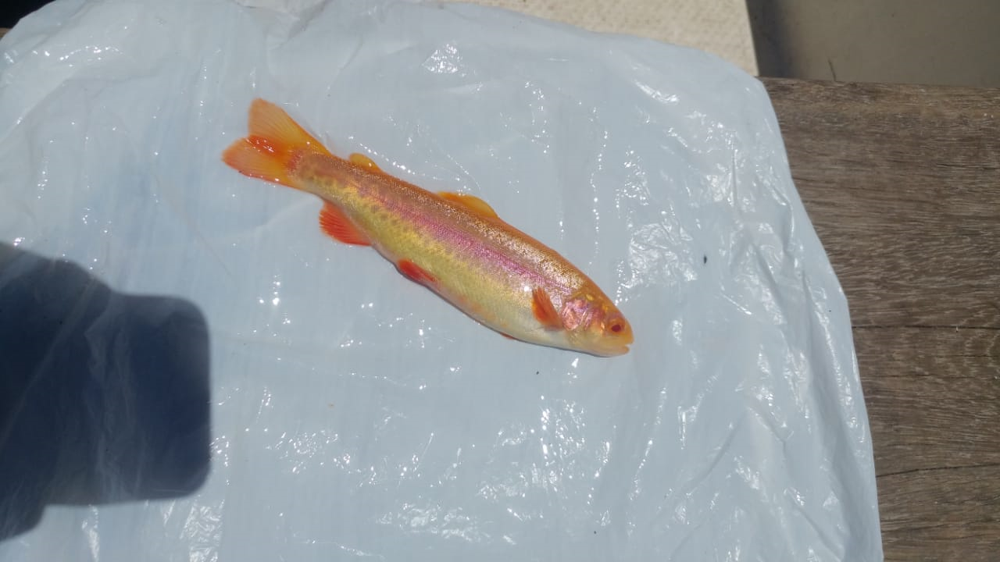

# Abstract {-}

# Resumen
El Perú se ubica entre los 10 países de mayor diversidad en el mundo. El Lago Titicaca presenta un ecosistemas con condiciones favorables como la calidad de sus aguas, presión, temperatura, humedad etc, el cual  favorece el desarrollo de una variedad  Trucha arcoíris, la trucha dorada o Kori Chaillwa" (voz aymara que significa pez de oro), se obtuvo del resultado de una mutación de embriones de la trucha que pasaron a ser incubados a diferentes profundidades bajo presiones naturales del agua íntimamente relacionadas con la altitud del Lago Titicaca esta variedad que presenta características especiales como un color dorado con manchas moteadas griseas  alrededor del cuerpo y presenta una línea lateral rosada entre otras características..
Se obtuvo muestras de 50 aletas pectorales (derecha), extrayendo su ADN por el método de salting out , se visualizó por medio de electroforesis y se  cuantificó el ADN utilizando el Nanodrop , para posteriormente amplificar una región especifica dentro de la región mitocondrial, para ello se utilizó el marcador mitocondrial 16S del rRNA , el paso siguiente consistió en la secuenciación , donde 

# I. Introducción
# 1.1.	Descripción y formulación del problema.
En los últimos años la acuicultura ha ido cobrando mayor importancia, desde fines de los 80 la producción de pesca se ha mantenido constante mientras que la acuicultura ha ido en continuo crecimiento. Para el 2030 la agenta de la FAO ofrece una visión de un mundo, libre de pobreza, hambre, malnutrición es asi como fija objetivos a la contribución y la práctica de la pesca y la acuicultura en bienestar de la seguridad alimentaria, de tal manera que se garantice un desarrollo sostenible. La producción pesquera mundial alcanzó un máximo de aproximadamente 171 millones de toneladas en 2016, de los cuales la acuicultura representó un 47% del total y un 53% si se excluyen los usos no alimentarios (harina y aceite de pescado). En el 2016 el valor total de la primera venta se estimó en 362 000 millones de USD, de los cuales 232 000 millones de USD procedían de la producción acuícola (FAO, 2018). El Perú no es un país ajeno a este crecimiento, según (Produce, 2017) se llegó a cosechar 100,455 (TM) de recursos hidrobiológicos, de los cuales las especies de mayor producción fueron la trucha, langostinos, concha de abanico, tilapia y otros donde la primera representó el 54,6 % de la cosecha de ese año ubicando a Puno como el primer productor de trucha. 
La trucha arcoíris (Oncorhynchus mykiis) es una especie introducida en el Perú en 1928 desde los Estados Unidos, se adaptaron rápidamente resultando beneficiosos como una fuente de alimento para los pobladores asi como para las piscigranjas tanto de manera artesanal como de mayor escala ,esta actividad también se ha visto impulsada por los gobiernos sin embargo no deja de presentar problemas como: inadecuado manejo lotes, selección de reproductores, baja homogeneidad en el cultivo, afectando el desempeño en el cultivo ya que estos factores se relacionan con la baja tasa de crecimiento, aumento de enfermedades, bajos niveles de supervivencia de alevines, aparición de enfermedades, deformidades, etc.
# 1.3. Objetivos 
#Objetivo general:
	Evaluar la diversidad genética de una variedad de trucha dorada del Lago Titicaca Oncorhynchus mikyss analizando la región de control mitocondrial.
Objetivo específico:
	Optimizar la reacción de PCR para la amplificación de la región de control mitocondrial.
	Autenticar mediante el uso del DNA Barcode que las muestras pertenecen a la especie objeto de estudio.
	Determinar los indicadores de diversidad (diversidad haplotípica y diversidad nucleotídica).

# 1.4. Hipótesis.-
Debido a que esta variedad se ha mantenido con cruzamientos consanguíneos a partir de una pequeña población de individuos que presentaban la mutación, se espera una baja diversidad genética respecto a la variedad común de trucha “coloración gris”.
# II.	Marco teórico.

# 2.1. Posición taxonómica de la Trucha arcoíris.
# 2.2. Filogénesis.
A inicios del Cretácico aparecieron los ancestros de los salmónidos hace aproximadamente entre los 60 y 135 millones de años en el hemisferio Norte en aguas dulces, empezaron a sufrir diferencias en la era terciaria (Mioceno) y a principios del Cuaternario en el Pleistoceno aparecieron los géneros de los salmónidos actuales cuyas diferenciaciones fueron producto de la glaciación, pos glaciación y separación de continentes (Breton, 2007, p.25). Bagliniére, (1991) afirma: En la última glaciación algunas poblaciones quedarían aisladas y otras mostraron un carácter migratorio.
# 2.3. Distribución geográfica.
En Europa (Francia) nació la piscicultura y se extendió por toda Europa (Tessier 1967), esta actividad se ha extendido por todo el mundo, hallándose en países como Canadá, Estados unidos, Japón, Australia, Nueva Zelanda, Sudáfrica, Chile, Noruega donde ha tenido un gran crecimiento, entre otros países.
Es en el siglo XIX con la reproducción artificial de la trucha nace la piscicultura y se extiende (Breton, 2007, p.26).
 (Berra, 1981) citado por Palma et al, 2002. Menciona que en Sudamérica la fauna íctica continental cuenta con un gran número de familias en el mundo.
Se han registrado 46 familias, de las cuales 32 son endémicas, con unas 2.400 a 2.700 especies conocidas (Gery 1969)
2.4. Características morfológicas de la trucha arcoíris.
Los peces son animales de sangre fría, la trucha arcoíris pertenece al grupo de los osteistios, la forma de su cuerpo es aerodinámica. La piel es la primera barrera de protección, éste segrega una sustancia viscosa, también se encuentran las escamas formando una cubierta de protección, su cuerpo está dividido en 3 partes cabeza, tronco y cola. Una trucha posee siete aletas, además de la cola, sus aletas tienen funciones particulares que le permiten hacer maniobras de su cuerpo además de brindarle estabilidad, su esqueleto óseo se compone de una  columna vertebral que posee de 28 a 29 vertebras unidas por el tejido conectivo; presenta un sistema circulatorio sencillo, su  riñón es un órgano alargado ubicado debajo de la espina dorsal y encima de la vejiga natatoria, extendiéndose desde la cabeza hasta la cola, para los peces de agua dulce este órgano es más importante ya que por ahí se elimina que el exceso de agua, también se sabe presetnan células gustativas y estudios recientes  ha demostrado que los peces son capaces de distinguir 4 sabores básicos (dulce, salado, ácido y amargo también pueden percibir la composición química del agua, esto es muy importante para los peces migratorios como el salmón que sigue la gradiente de olor reconociendo su rio natal a donde se dirige para desovar (Mancini, 2002).
La línea lateral es un sentido exclusivo de los peces, se ubica en la parte central es de color  rosada y su cuerpo se encuentra moteado de color gris para esta variedad de trucha, comienza en la cabeza y termina en la base de la cola sirve para detectar pequeños cambios en su medio, como cambios de presión del agua,  la línea lateral es un sistema de poros que se encuentran unidos entre si  por una red de pequeños canales a lo largo del cuerpo, cuando el pez se desplaza el agua se mueve , estas ola de presión que se producen por su desplazamiento refleja la ausencia de obstáculos y retorna al pez ante cualquier obstáculo (Linnaeus, 1885).
```{r}

```

 
Figura   : Trucha dorada su cuerpo está dividido en cabeza, cuerpo y cola, presenta  el cuerpo moteado de color gris y una línea lateral con 7 aletas además de la cola. Fuente propia.

# IV. Material y Método.

## 4.1. Materiales 

## 4.1.1. Material biológico.
Los individuos fueron colectados en el mes de Enero del 2019, se obtuvieron un total de 50 muestras (aleta pectoral derecha) de trucha dorada del Lago Titicaca Oncorhynchus mikyss, se preservaron en alcohol de 96% para su preservación y posteriormente se trasladó a la FOPCA al Laboratorio de Biología Molecular de la UNFV.

# Resultados

## Extracción de ADN.

La extracción de ADN se llevó a cabo siguiendo el método original 

DISCUSIÓN.
El desarrollo de los métodos moleculares ha llevado a la necesidad de crear métodos de extracción de ADN más simples y eficientes, sin embargo, variaciones en la eficiencia de la lisis, el rendimiento y la pureza del ADN pueden afectar los resultados de técnicas moleculares como la RCP, la hibridización y el clonaje


